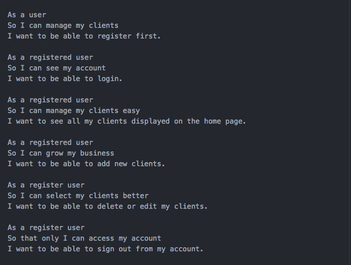
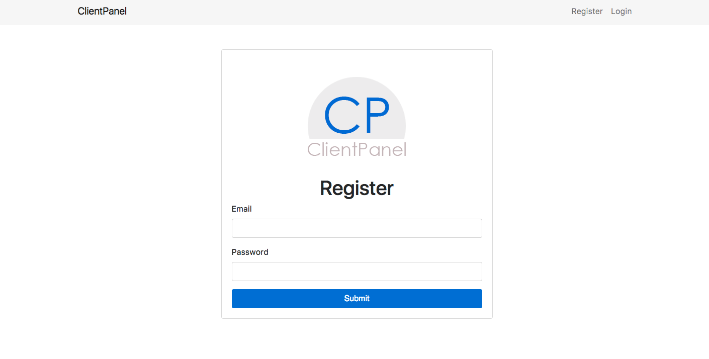
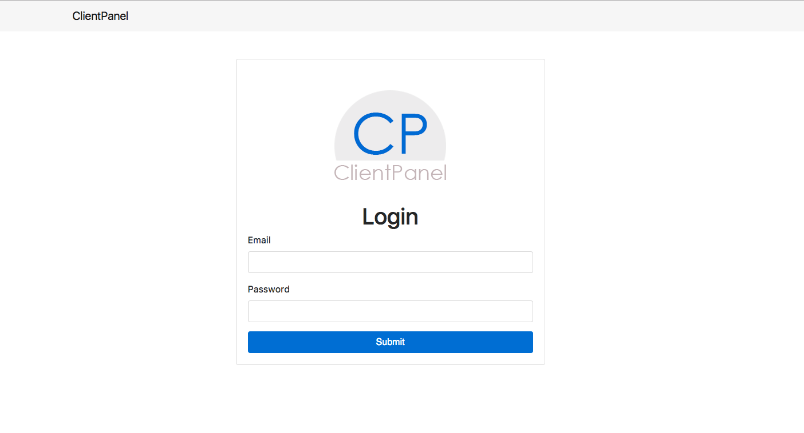
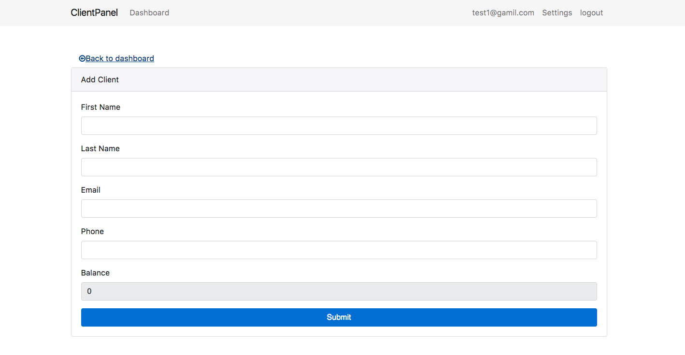
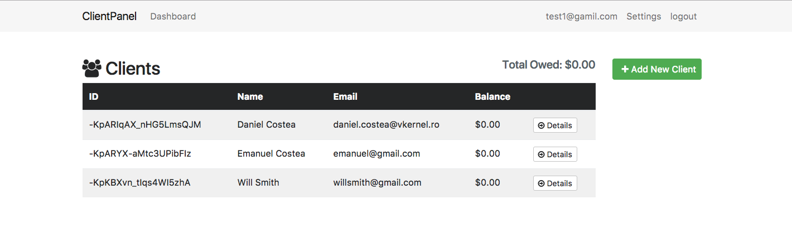
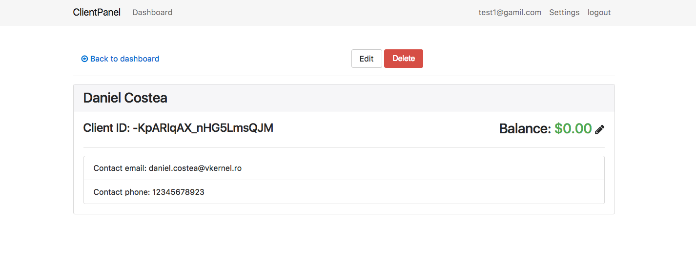
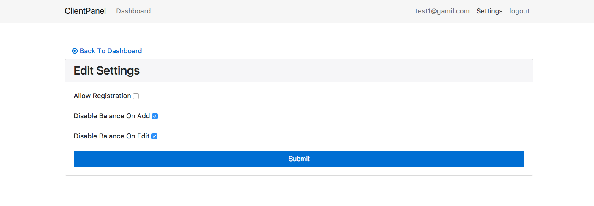
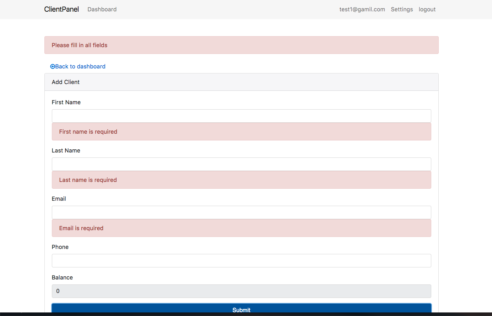

# Clientpanel

This project was generated with [Angular CLI](https://github.com/angular/angular-cli) version 1.2.0.

#### User stories

### Development server

Run `ng serve` for a dev server. Navigate to `http://localhost:4200/`. The app will automatically reload if you change any of the source files.

### Project summary
* I build the project using Angular 4 as a front-end and I used
Firebase to store my data
* I used AngularFire 2 library to connect with Firebase
* For authentication process I used AngularFireAuth which allows you to login and logout your users
* The project is structured in numerous components for keeping the code clean and easy to follow
* Version control used: Git

### Project functionality

#### User can register

  

#### User can login

#### User can add client

#### In the dashboard you have all the clients displayed with there info and the specific ID

#### You can see a edit or delete a client by pressing the 'Details' button

#### You can customize the balance and register display by going to "Settings"

#### I also imported the Angular-Flash-Messages which throws you an error if a specific field is empty

## Further help

To get more help on the Angular CLI use `ng help` or go check out the [Angular CLI README](https://github.com/angular/angular-cli/blob/master/README.md).
